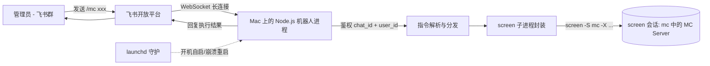

# 飞书 → Mac 端 MC 服务器控制机器人 · 设计方案

> 目标：在 Mac 上常驻一个飞书机器人，监听指定飞书群中的指令，对本机 Minecraft 服务器执行 `status / stop / kill / restart` 操作；使用飞书**长连接（WebSocket）模式**，无需公网回调。

---

## 1. 总体架构



关键点：

- 使用飞书官方 SDK [`@larksuiteoapi/node-sdk`](https://github.com/larksuite/node-sdk) 的 `WSClient` 建立长连接，订阅 `im.message.receive_v1` 事件。
- 业务侧仅做：**鉴权 → 解析指令 → 调用 screen → 回复消息**。
- MC 进程托管在固定名称的 `screen` 会话中（`screen -S mc`）；机器人通过 `screen -X stuff` 向 MC 控制台注入命令。

---

## 2. 目录结构

```
feishu-mc-bot/
├── src/
│   ├── index.ts            # 入口：装配 client、handler，启动 WSClient
│   ├── config.ts           # dotenv + zod 配置校验
│   ├── logger.ts           # pino 日志
│   ├── mc/
│   │   ├── screen.ts       # screen 原子操作封装
│   │   └── service.ts      # status/stop/kill/restart 业务逻辑
│   └── feishu/
│       ├── client.ts       # lark.Client + WSClient 初始化、消息发送
│       └── handler.ts      # 事件回调、鉴权、指令分发
├── scripts/
│   └── com.user.feishu-mc-bot.plist   # launchd 守护示例
├── .env.example
├── .gitignore
├── package.json
├── tsconfig.json
└── README.md
```

---

## 3. 飞书侧配置（README 中详述）

1. 飞书开放平台 → **创建企业自建应用** → 拿到 `App ID` / `App Secret`。
2. 「机器人」能力 → 开启，并把应用拉入目标群。
3. 「权限管理」开启：
   - `im:message`、`im:message.group_at_msg`（监听群内 @ 消息）
   - `im:message:send_as_bot`（发消息）
4. 「事件与回调」→ 订阅 `im.message.receive_v1`。
5. 「事件与回调」→ **传输方式选「长连接」**（无需公网回调 URL）。
6. 发布应用版本，等待管理员审批通过。

> 长连接模式由 SDK 内的 `WSClient` 直接连到飞书 WebSocket 网关，Mac 不需要暴露公网端口。

---

## 4. 环境变量（[`.env.example`](.env.example:1)）

```dotenv
# 飞书应用凭证
APP_ID=cli_xxx
APP_SECRET=xxx

# 飞书域：feishu 国内 / lark 国际
LARK_DOMAIN=feishu

# 鉴权白名单（逗号分隔；任一空则视为禁用）
ALLOWED_CHAT_IDS=oc_xxx,oc_yyy
ADMIN_USER_IDS=ou_xxx,ou_yyy

# MC / screen
SCREEN_SESSION=mc
MC_START_SCRIPT=~/mc-server/start.sh
# stop 后等待会话退出的最长时间（毫秒）
MC_GRACEFUL_TIMEOUT_MS=60000

# 日志
LOG_LEVEL=info
```

---

## 5. 指令规范

| 指令          | 说明                                                                                                                                                                  |
| ------------- | --------------------------------------------------------------------------------------------------------------------------------------------------------------------- |
| `/mc status`  | 检查 `screen -ls` 中是否存在名为 `mc` 的会话，返回 RUNNING / STOPPED                                                                                                  |
| `/mc stop`    | 向 MC 控制台发送 `stop\n`，轮询等待 screen 会话退出，超时则提示用户改用 `/mc kill`                                                                                    |
| `/mc kill`    | 先 `screen -S mc -X quit` 强制关闭会话；若仍残留 java 进程，使用 `pkill -f` 兜底（基于启动脚本路径精确匹配）                                                          |
| `/mc restart` | 先执行 stop 流程（失败则 kill 兜底），确认 MC 退出后，在启动脚本所在目录执行 `screen -dmS mc bash <脚本>`；启动后轮询 `screen -ls` 验证；返回最终状态                 |

消息识别规则：

- 仅处理 `message_type == "text"` 且文本以 `/mc` 开头的消息（trim 后）。
- 兼容群里 @机器人 的情况：剔除 `<at>` 等富文本片段后再 trim。
- 在 `chat_id ∉ ALLOWED_CHAT_IDS` 或 `sender_id.open_id ∉ ADMIN_USER_IDS` 时，**静默忽略**或回复「无权限」（推荐：群不在白名单则静默，群在白名单但用户不是管理员则提示）。

---

## 6. 关键实现要点

### 6.1 [`src/mc/screen.ts`](src/mc/screen.ts:1)

封装为 Promise 化的子进程调用（`child_process.execFile`）：

- `sessionExists(name)`：`screen -ls`，正则匹配 `\.<name>\s+\(`。
- `sendStuff(name, text)`：`screen -S <name> -p 0 -X stuff "<text>"`（注意把 `\n` 转成实际换行）。
- `quitSession(name)`：`screen -S <name> -X quit`。
- `startSession(name, scriptAbsPath)`：`screen -dmS <name> bash <脚本>`，`cwd` 设为脚本所在目录；启动后短轮询确认会话出现。
- `waitUntilGone(name, timeoutMs)` / `waitUntilUp(name, timeoutMs)`：300–500 ms 间隔轮询。

### 6.2 [`src/mc/service.ts`](src/mc/service.ts:1)

```ts
async function stop(): Promise<Result> {
  if (!(await sessionExists(cfg.session))) return { ok: true, msg: 'already stopped' };
  await sendStuff(cfg.session, 'stop\n');
  const gone = await waitUntilGone(cfg.session, cfg.gracefulTimeoutMs);
  return gone ? { ok: true } : { ok: false, msg: 'graceful stop timed out, 请使用 /mc kill' };
}
```

`restart` = `stop`（失败则 `kill`）→ `waitUntilGone` → `startSession` → `waitUntilUp`。
`kill` 全部错误均吞掉并继续，最终以「screen 会话不再存在」为成功判据。

### 6.3 [`src/feishu/client.ts`](src/feishu/client.ts:1)

```ts
import * as lark from '@larksuiteoapi/node-sdk';

export const client = new lark.Client({ appId, appSecret, domain: lark.Domain.Feishu });
export const wsClient = new lark.WSClient({ appId, appSecret, domain: lark.Domain.Feishu });

export async function replyText(messageId: string, text: string) {
  await client.im.message.reply({
    path: { message_id: messageId },
    data: { content: JSON.stringify({ text }), msg_type: 'text' },
  });
}
```

### 6.4 [`src/feishu/handler.ts`](src/feishu/handler.ts:1)

```ts
const dispatcher = new lark.EventDispatcher({}).register({
  'im.message.receive_v1': async (event) => {
    const { message, sender } = event;
    if (!cfg.allowedChatIds.includes(message.chat_id)) return;
    if (message.message_type !== 'text') return;

    const text = extractPlainText(message.content);   // 去 @、trim
    if (!text.startsWith('/mc')) return;

    if (!cfg.adminUserIds.includes(sender.sender_id.open_id)) {
      await replyText(message.message_id, '⛔ 无权限');
      return;
    }

    const sub = text.split(/\s+/)[1];
    const result = await runCommand(sub);              // status/stop/kill/restart
    await replyText(message.message_id, formatResult(sub, result));
  },
});

wsClient.start({ eventDispatcher: dispatcher });
```

### 6.5 [`src/index.ts`](src/index.ts:1)

- 启动 `wsClient`。
- 监听 `SIGINT` / `SIGTERM`，调用 `wsClient` 优雅停止后退出。
- 顶层 `process.on('unhandledRejection' / 'uncaughtException')` 记日志、不退出，由 launchd 守护。

---

## 7. launchd 守护（[`scripts/com.user.feishu-mc-bot.plist`](scripts/com.user.feishu-mc-bot.plist:1)）

要点：

- `RunAtLoad=true`、`KeepAlive=true` 实现崩溃重启。
- `WorkingDirectory` 指向项目目录；`ProgramArguments` 用 `node dist/index.js`（或 `npx tsx src/index.ts`）。
- `EnvironmentVariables` 中至少注入 `PATH`（含 `/usr/local/bin`、`/opt/homebrew/bin`，保证能找到 `screen` 与 `node`）。
- 加载：`launchctl load -w ~/Library/LaunchAgents/com.user.feishu-mc-bot.plist`。

---

## 8. 安全与健壮性清单

- 鉴权双层：群白名单（粗）+ 管理员 user_id 白名单（细）。
- 所有指令串行执行（用一个全局 mutex），避免 stop 与 restart 并发。
- `child_process.execFile` 而非 `exec`，参数数组形式传入，杜绝 shell 注入。
- screen 会话名通过 zod 校验为 `^[A-Za-z0-9_-]+$`。
- 日志脱敏：不打印 `APP_SECRET`。
- README 提供「screen 没装 / launchd PATH 找不到 node / 长连接频繁断开 / 鉴权未通过」常见问题排查。

---

## 9. 交付物

1. 完整可运行的 Node.js + TypeScript 项目源码。
2. [`.env.example`](.env.example:1) 与 [`README.md`](README.md:1)（含飞书侧逐步截图位、Mac 侧部署、launchd 安装命令）。
3. launchd plist 示例。

---

## 10. 后续可选增强（非本期）

- `/mc say <text>`：向 MC 控制台广播。
- `/mc tps` / `/mc players`：解析 MC 输出（需要把 screen 输出 hardcopy 到文件再读取）。
- 操作审计日志写入文件并支持 `/mc log` 拉取最近 N 条。
- 多 MC 实例（多 screen 会话）支持。
